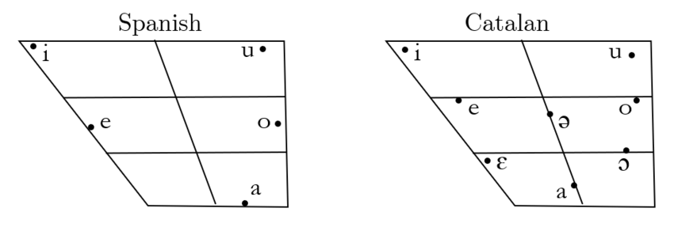
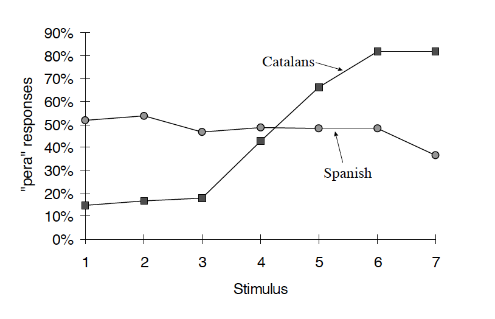
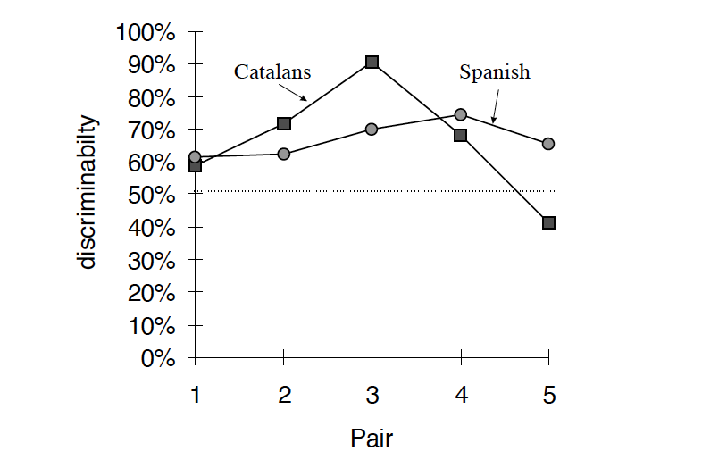
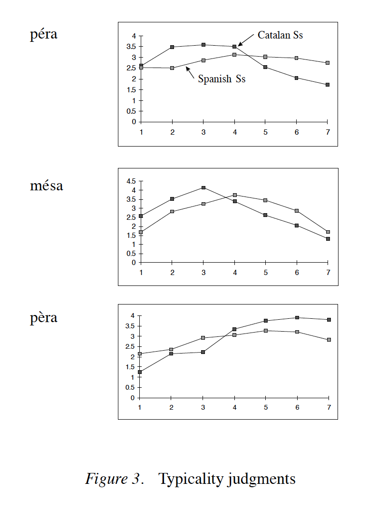

# Introduction

* Languages differ in the sounds they use to make up words and this has consequences for perceptual processing (Goto, 1971; Werker & Tees, 1984).

 

* Listeners are attuned to the properties of the speech signal which are most relevant for their language (Otake et al., 1993, 1996; Dupoux et al., 1997).

 

* This tuning takes place in the first year of life (Kuhl, 1994; Werker, 1994).

 

* **But what happens to listeners who grew up in bilingual settings?**

---
 
* **Production**:

  + The later the start of exposure to the L2, the more noticeable is the 'foreign accent' (Oyama, 1976).

  + A non-native accent can be detected when the AoA was above 6 years (Long, 1990).
  
  + Possible explanation: loss of flexibility in learning new motor programs.
  
* **Perception**:

  + Late learners are typically less sensitive to language-specific phonemes propertie than early learners.
  
  + But less is known about the time schedule of the loss of plasticity in perception.
  
  + It remains debated whether production loses flexibility before perception.

* Most recent data says that non-natives resemble native speakers more closely in perceiveing than in producing some sounds (Flege, 1993).

---

# Present study

* Bilinguals from Catalonia who had been learning their L2 before 6 years of age.

  + Group 1: Catalan L1 - Spanish L2
  + Group 2: Spanish L1 - Catalan L2

* Highly proficient in Catalan and Spanish.

  + **Why** did the authors use this subject population for their study?
  
* Focused on the [e]-[ɛ] contrast. Present in Catalan but not Spanish.

---

# Method

* **Stimuli** preparation

  + A series of sevel vowel stimuli were synthesized along a continuum from [e] to [ɛ].
  
  + They only differed in the frequency of the first formant that increased from 404 Hz to 584 Hz.
  
  + For all stimuli, F2 was set to 2084 Hz, the duration to 200 ms, and a slowly declining pitch was imposed.
  
* Stimuli were employed in **three tests** administered to each subject:

  1. A classification task
  
  2. An AX discrimination task
  
  3. A typicality judgment task

---
# Experiment 1

* Classification task:

  + 40 subjects were presented with a list in which each stimulus appeared nine times, in a randomized order.
  + The task consisted in deciding, after each stimulus, whether it sounded more like [pera] or [pɛra].

* Results

  + Catalan-born subjects were able to map the stimuli onto the two words.
  + Spanish-born subjects produced a flat response curve.
  + **How** do these results explain the need for **experiment 2**?

  

---
# Experiment 2

* Discrimination task:

  + Subjects were presented with pairs of stimuli: 7 "same" pairs repeated 4 times each, and 5 "different" pairs, repeated 8 times each.
  + After each pair, subjects had to indicated whether the stimuli sounded identical or different.
  
* Results:

  + Only Catalan-born subjects showed a peak for the S3-S5 pair.
  + They partition the continuum into two phonemic categories.
  + Catalan and Spanish groups perceive the vowel continuum differently.

  

---

# Experiment 3

* Typicality judgement:

  + Subjects were asked to rate the 'category-goodness' of each of the seven stimuli, relative to a Spanish [e], a Catalan [e], and a Catalan [ɛ].
  
  + One of three words examplifying each phoneme was presented on a computer screen for 1s.
  
  + Subjects were asked to form a 'mental image' of the first vowel.
  
  + After that, the word disappeard from the screen and one of the the seven vowel stimuli was played.
  
  + Subjects had to give a score assessing the fit of the stimulus with the imagined vowel.
  
---
  
# Experiment 3

* Results:

  

---

# Experiment 3 

* Results:

  + Catalan-born subjects produced the expected responses for the two Catalan vowels, but not for the Spanish [e].
  
  + Catalan speakers conflate the Spanish and the Catalan [e] into one category.
  
  + Spanish-born subjects did not exhibit the same behavior on the three vowels.
  
  + Spanish-born subjects are not totally unaware of the existance of different vowels in Catalan.
  
  + However, they cannot perform like Catalan-born subjects.
  
---

# Conclusions

* Spanish L1 - Catalan L2 bilinguals do not master the contrast between Catalan [e] and [ɛ] phonemes.

* Loss of plasticity with age.

* Early exposure is not sufficient.

* After exposure to Spanish leads to the formation of one [e] category.

* Catalan-born subjects did not learn the third category after exposure to Spanish.

* **What** two conclusions can we draw in terms of vowel space and sound system based on these results for Spanisn-Catalan bilinguals?

